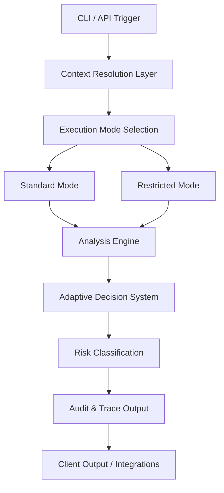

# Sentinel Architecture: Strategic Overview (v3.8.0)

## 1. System Philosophy
Sentinel is an **Adaptive Security Decision Engine (ASDE)** designed to bridge the gap between static scanning and autonomous policy enforcement. The architecture emphasizes **Contextual Intelligence** and **Explainable Verdicts**.

## 2. High-Level Execution Flow

## 3. Core Intelligence Layers

### 3.1 Adaptive Decision System (ADS)
The ADS is the primary orchestration core of Sentinel. It correlates multiple observational signals using proprietary contextual weighting to emit deterministic risk classifications.

### 3.2 Contextual Resolution & Mode Selection
Before analysis, Sentinel evaluates the execution environment and caller identity to determine the appropriate depth of evidence exposure. This ensuring that high-value intelligence is only accessible to authorized entities.

### 3.3 Audit and Forensic Integrity
Every decision is recorded with a structured evidence trace, providing full explainability for security teams while maintaining the integrity of the underlying decision logic.

## 3. Core Protection Layers

### 3.1 Playbook Orchestration
Sentinel uses the **Sentinel Playbook Language (SPL)** to define complex, stateful security workflows. This layer abstracts the underlying engine logic, allowing for "Collective Intelligence" where multiple signals are correlated before a final verdict is reached.

### 3.2 Intelligence Persistence (Risk Graph)
The system maintains a directed graph of relationships between packages, repositories, and historical decisions. This enables cross-repository correlation and reputational intelligence.

### 3.3 Defense-in-Depth Mechanisms (Patent Pending)
Sentinel implements several proprietary mechanisms to prevent intelligence leakage and engine reverse-engineering:
- **Oracle Defense Protocol**: Dynamic intelligence throttling based on caller authorization.
- **Decision Jitter & Quantization**: Obfuscation of granular scores to prevent probing attacks.
- **Federated Trust Modeling**: Multi-tiered weighting of intelligence sources.

---
**NOTICE: Certain architectural details and low-level specifications have been redacted from this document to protect intellectual property. For full technical specifications, refer to the internal documentation repository.**

*Copyright © 2026 Sentinel Security. Patent Pending.*
