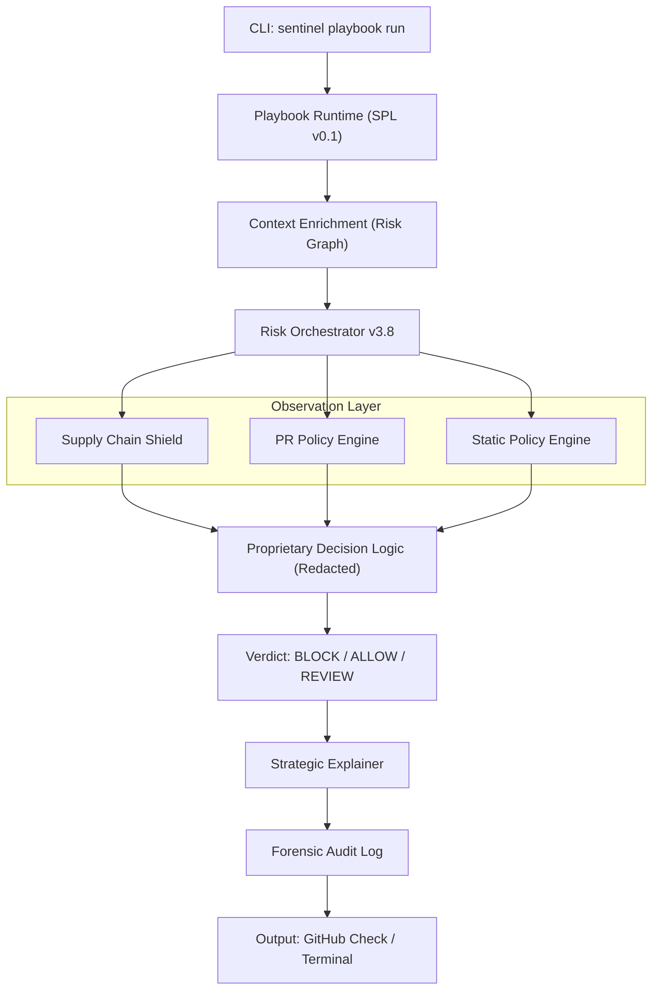

# Sentinel Architecture: High-Level Overview (v3.8.0)

## 1. System Philosophy
Sentinel is designed as a **Security Decision Engine (SDE)** with a Zero-Trust posture. The architecture is modular, separating the observation (Engines), orchestration (SPL), and intelligence (Risk Graph) layers.

## 2. Global Execution Flow

## 3. Core Protection Layers

### 3.1 Playbook Orchestration
Sentinel uses the **Sentinel Playbook Language (SPL)** to define complex, stateful security workflows. This layer abstracts the underlying engine logic, allowing for "Collective Intelligence" where multiple signals are correlated before a final verdict is reached.

### 3.2 Intelligence Persistence (Risk Graph)
The system maintains a directed graph of relationships between packages, repositories, and historical decisions. This enables cross-repository correlation and reputational intelligence.

### 3.3 Defense-in-Depth Mechanisms (Patent Pending)
Sentinel implements several proprietary mechanisms to prevent intelligence leakage and engine reverse-engineering:
- **Oracle Defense Protocol**: Dynamic intelligence throttling based on caller authorization.
- **Decision Jitter & Quantization**: Obfuscation of granular scores to prevent probing attacks.
- **Federated Trust Modeling**: Multi-tiered weighting of intelligence sources.

---
**NOTICE: Certain architectural details and low-level specifications have been redacted from this document to protect intellectual property. For full technical specifications, refer to the internal documentation repository.**

*Copyright © 2026 Sentinel Security. Patent Pending.*
